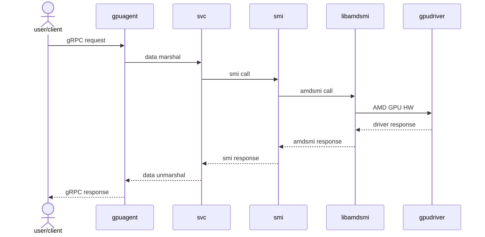

# Developer Guide

This document different components for developers working on the AMD GPU-Agent enhancement.

## Build Prerequisites

Before starting, ensure you have Docker installed and running with the user permissions set appropriately.

## Environment and Build Setup

Refer to the [README.md](README.md)

# Architecture

## API layer
- North Bound [API definitions](sw/nic/gpuagent/protos)
- Internal gpuagent [Model Definitions](sw/nic/gpuagent/api)

## Service layer
gRPC services are being handled through service layer [svc](sw/nic/gpuagent/svc)

## Data Abstraction layer
[smi](sw/nic/gpuagent/api/smi) layer is responsible for 
populating/retrieving data from the clients through libraries. 
This takes care of translating internal data
[models](sw/nic/gpuagent/api/include) to respective protobuf payloads for the
northbound definitions.

### Data clients
- amdsmi : data obtained through [libamdsmi](sw/nic/gpuagent/api/smi/amdsmi/smi_api.cc)

